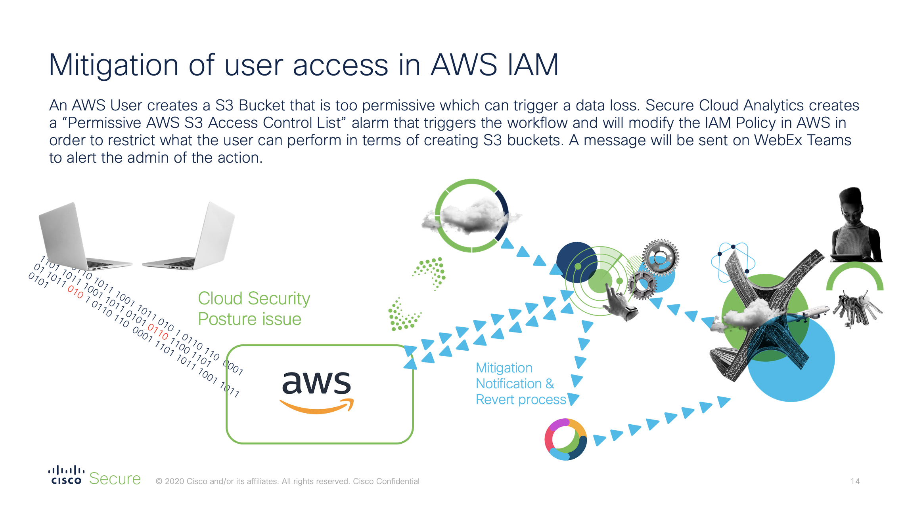
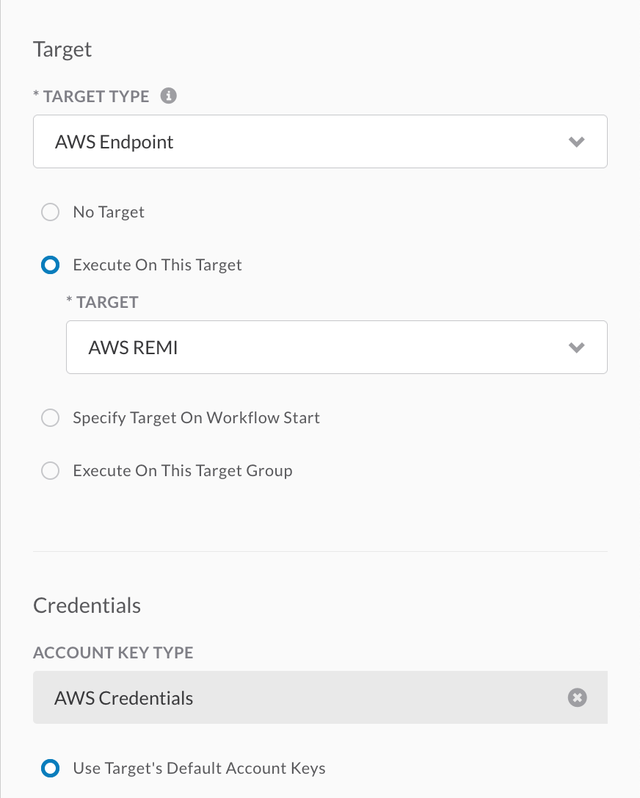

## Features
# Automated Remediation with SecureX for Secure Cloud Analytics and AWS IAM 

This is a SecureX playbook to automate quarantine through AWS IAM upon receiving Stealthwatch Cloud alerts. In this playbook, we use an e-mail trigger to start the workflow. When Stealthwatch Cloud gets an alert, it will send an e-mail to a mailbox. 
SecureX is configured with an IMAP listener on this mailbox to collect the alert e-mail. 
When the e-mail is retrieved, the workflow will parse the information to only keep the AWS Username that created the alert. 
Later, it will apply a specific new policy for this user in order to limit what he is able to do. Once the user has been remediated a notification can be send through Webex Teams 
There are lots of different possible scenario here is an example : 

[https://www.youtube.com/watch?v=2OS3SgVVFdU](https://www.youtube.com/watch?v=2OS3SgVVFdU)

> **Note:** Please test this properly before implementing in a production environment. This is a sample workflow!

## Configure 

* Configure e-mail in Stealthwatch Cloud : 
In Stealthwatch Cloud --> Top Right wheel --> Services/Webhooks --> E-mail 

* Import the JSON file in SecureX : 
In SecureX --> Orchestration --> Workflows --> Import --> Browse --> SWC-AWS IAM Workflow

## Requirements 
* E-mail address to be used to send Secure Cloud Analytics Alert

## Required Target 
* Target to be configured 
   --> AWS Account 
   

## Required Account Keys
* Account Keys to be configured : 
    --> Mailbox used - in my case I used a simple Gmail account. 
    --> AWS Credentials 

## Required Global Variables    
* Variables (optional)
   --> Webex Team key 
   
## Setup instructions

### Configure Global Variables

1. Browse to your SecureX orchestration instance. This wille be a different URL depending on the region your account is in: 

* US: https://securex-ao.us.security.cisco.com/orch-ui/workflows/
* EU: https://securex-ao.eu.security.cisco.com/orch-ui/workflows/
* APJC: https://securex-ao.apjc.security.cisco.com/orch-ui/workflows/

2. In the left hand menu, select **Variables**.

3. Next steps.

### Import main workflow

1. In the left pane menu, select **Workflows**. Click on **IMPORT** to import the workflow.

2. Click on **Browse** and copy paste the content of the [SWC-AWS IAM Workflow.json](https://raw.githubusercontent.com/vacheremi63/SecureX/master/AWS-SWC/SWC-AWS-IAM-Workflow.json) file inside of the text window.  Select **IMPORT AS A NEW WORKFLOW (CLONE)** and click on **IMPORT**.

3. Next steps, like updating targets / account keys and setting a trigger / running the workflow.

### Secure Cloud Analytics Configuration 
* Configure e-mail in Stealthwatch Cloud : 
In Stealthwatch Cloud --> Settings --> Services/Webhooks --> E-mail 

## Notes

* Please test this properly before implementing in a production environment. This is a sample workflow!

## Author(s)

* Remi VACHER (Cisco)
