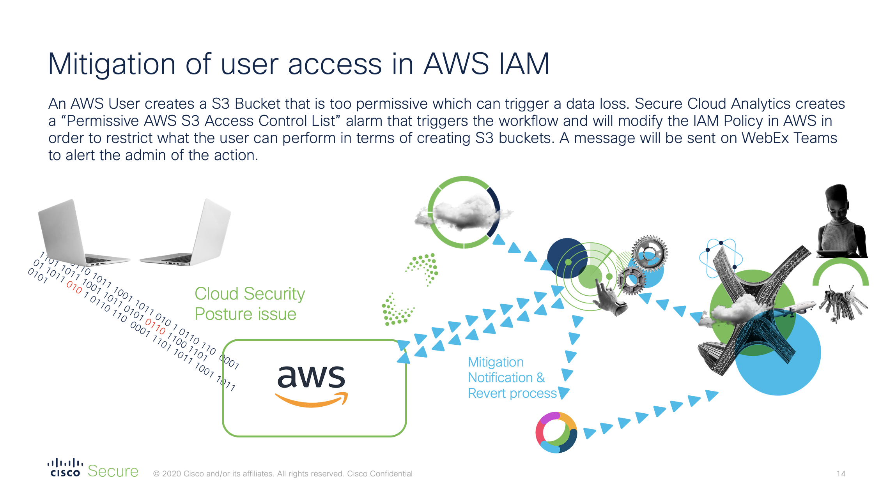

# Automated Remediation with SecureX for Secure Cloud Analytics and AWS IAM 

This is a SecureX playbook to automate quarantine through AWS IAM upon receiving Stealthwatch Cloud alerts. In this playbook, we use an e-mail trigger to start the workflow. When Stealthwatch Cloud gets an alert, it will send an e-mail to a mailbox. 
SecureX is configured with an IMAP listener on this mailbox to collect the alert e-mail. 
When the e-mail is retrieved, the workflow will parse the information to only keep the AWS Username that created the alert. 
Later, it will apply a specific new policy for this user in order to limit what he is able to do. Once the user has been remediated a notification can be send through Webex Teams 
There are lots of different possible scenario here is an example : 

[https://www.youtube.com/watch?v=2OS3SgVVFdU](https://www.youtube.com/watch?v=2OS3SgVVFdU)

